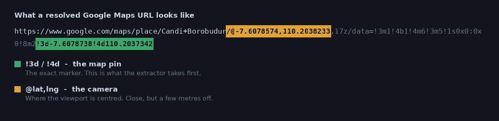

# Google Maps Link → GPS Coordinates

Turn a column of Google Maps share links into a clean latitude/longitude table.

[](https://github.com/Andreasbunyamin/gmaps-link-gps-extractor/actions/workflows/tests.yml)
[](https://www.python.org/downloads/)
[](LICENSE)

---

## The problem

When someone in the field marks a location, the easiest thing they can do is tap
**Share** in the Google Maps app. That produces a short link:

```
https://maps.app.goo.gl/XXXXXXXXXXXX
```

Which is fine for sending to a colleague, and useless for anything else. You cannot
plot it, measure a distance from it, cluster it, or join it to another table. And
once a few hundred of them have piled up in a spreadsheet, opening each one by hand
is not a plan.

This project resolves those links in bulk and writes back the coordinates.

| PLACE NAME | LINK GMAPS | → | Latitude | Longitude | Source |
|---|---|---|---|---|---|
| Candi Borobudur | `maps.app.goo.gl/...` | | `-7.6078738` | `110.2037342` | `pin_url` |
| Pura Tanah Lot | `maps.app.goo.gl/...` | | `-8.6212058` | `115.0868341` | `pin_url` |
| Pantai Parangtritis | `maps.app.goo.gl/...` | | `-8.0255` | `110.3300` | `camera_url` |

---

## How it works

### Why a browser is involved

A short Maps link cannot be expanded with a plain HTTP request. Google answers with
a JavaScript interstitial and, in most regions, a cookie consent page. So the tool
drives a headless Chrome session, lets it follow the redirect, and reads the
coordinates out of the **final** URL.

A consent cookie is injected once at startup rather than per request, and a single
driver is reused for the whole batch. Launching Chrome per row is the difference
between a five-minute job and a two-hour one.

### The URL carries the position twice



| Fragment | What it is | Precision |
|---|---|---|
| `!3d<lat>!4d<lng>` | the **map pin** — the place itself | exact |
| `@<lat>,<lng>,17z` | the **camera** — where the viewport is centred | a few metres off |

Reading `@` is the common mistake, because it is the first thing you notice in the
URL. This tool always prefers `!3d`/`!4d`.

### The fallback chain

Not every link resolves cleanly, so extraction runs as a priority chain and records
which rule matched in a `Source` column. That way a low-confidence row stays visible
instead of quietly blending in with the good data.

| Priority | `Source` | Where it was found | Trust |
|---|---|---|---|
| 1 | `pin_url` | `!3d`/`!4d` in the resolved URL | exact |
| 2 | `pin_html` | `!3d`/`!4d` in the page source | exact |
| 3 | `camera_url` | `@lat,lng` viewport centre | approximate |
| 4 | `place_url` | `/place/<name>/@lat,lng` | approximate |
| 5 | `query_param` | `?q=` / `?ll=` / `?query=` | as supplied |
| 6 | `loose_url` | any high-precision pair in the URL | unverified |
| 7 | `js_html` | coordinates in the inlined JS payload | unverified |
| — | *(blank)* | nothing usable — blank cell, junk text, dead link | — |

Filtering for anything that is not `pin_url` or `pin_html` gives you the review queue:

```python
needs_review = df[~df["Source"].isin(["pin_url", "pin_html"])]
```

---

## Quick start

```bash
git clone https://github.com/Andreasbunyamin/gmaps-link-gps-extractor.git
cd gmaps-link-gps-extractor

python -m venv .venv && source .venv/bin/activate   # Windows: .venv\Scripts\activate
pip install -e ".[browser,dev]"
```

Run it against the bundled sample data, no browser needed:

```bash
python -m gmaps_gps --input data/sample_tourist_places.xlsx --no-browser --csv
```

```
Loaded 36 rows from data/sample_tourist_places.xlsx
Wrote output/gps_coordinates.xlsx
Resolved 34/36 links
```

Run it on your own file:

```bash
python -m gmaps_gps \
  --input  path/to/your_locations.xlsx \
  --sheet  Sheet1 \
  --link-column "LINK GMAPS" \
  --output output/results.xlsx \
  --delay  0.5
```

<details>
<summary>All options</summary>

| Flag | Default | What it does |
|---|---|---|
| `-i, --input` | `data/sample_tourist_places.xlsx` | Input `.xlsx` or `.csv` |
| `-s, --sheet` | `PLACES` | Worksheet name for `.xlsx` input |
| `-o, --output` | `output/gps_coordinates.xlsx` | Output workbook |
| `-c, --link-column` | `LINK GMAPS` | Column holding the links |
| `--no-browser` | off | Parse links as given, skip Selenium. Works only on already-expanded URLs |
| `--delay` | `0` | Seconds between rows — raise it for large batches |
| `--limit` | none | Process only the first N rows |
| `--csv` | off | Also write a `.csv` beside the `.xlsx` |
| `-q, --quiet` | off | Suppress per-row output |

Every default can also be set through `.env` — see `.env.example`.
</details>

### As a library

```python
from gmaps_gps import get_accurate_coords, extract_dataframe

# One link
result = get_accurate_coords("https://maps.app.goo.gl/XXXXXXXX")
print(result.latitude, result.longitude, result.source, result.is_exact)

# A whole table
df = extract_dataframe(df, link_column="LINK GMAPS", delay=0.5)
```

### As a notebook

[`notebooks/extract_gps_from_gmaps_links.ipynb`](notebooks/extract_gps_from_gmaps_links.ipynb)
walks through the same pipeline step by step, with the Chrome install cells for
Google Colab. Good for a one-off run or for seeing the logic laid out end to end.

---

## Project structure

```
├── src/gmaps_gps/
│   ├── url_parser.py      # pure extraction logic — no browser, no network
│   ├── scraper.py         # Selenium session, redirect + consent handling
│   ├── pipeline.py        # batch processing over a DataFrame
│   ├── exporter.py        # formatted Excel output
│   └── cli.py             # command-line interface
├── notebooks/             # step-by-step walkthrough (Colab-ready)
├── data/                  # synthetic sample dataset
├── tests/                 # 43 tests, browser-free
├── scripts/               # regenerate the sample data and the docs diagram
└── .github/workflows/     # CI
```

The extraction logic is deliberately separated from the browser. `url_parser.py`
takes strings and returns coordinates, which means the interesting part of the
project is unit-testable without launching Chrome — and the whole test suite runs
in CI in under a second.

---

## Tests

```bash
pytest
```

```
43 passed
```

Covering the priority chain, hemisphere handling, out-of-range rejection,
whitespace and tracking-suffix tolerance, blank and junk input, the Excel
round-trip, and the batch pipeline end to end.

---

## Sample data

`data/sample_tourist_places.xlsx` holds 36 public Indonesian tourist destinations —
Borobudur, Tanah Lot, Danau Toba, Raja Ampat and so on — generated by
[`scripts/make_sample_data.py`](scripts/make_sample_data.py). No private, customer
or business data appears anywhere in this repository.

The last six rows are awkward on purpose, so the fallback chain and the error
handling are both visible in the output:

| Row | What is wrong with it | Result |
|---|---|---|
| Pantai Parangtritis | camera-only URL, no map pin | `camera_url` |
| Taman Nasional Way Kambas | coordinates in a `?q=` parameter | `query_param` |
| Benteng Vredeburg | leading/trailing whitespace | resolves fine |
| Pantai Pink Lombok | `?g_st=iw` tracking suffix | resolves fine |
| Pulau Weh Sabang | blank cell | blank, no crash |
| Green Canyon Pangandaran | free-text note instead of a link | blank, no crash |

The sample links are written in Google Maps' **expanded** form, which is exactly
what a `maps.app.goo.gl` link resolves to. Short links belong to whoever created
them and can expire, so pinning a public demo to them would leave a broken
repository behind. Drop your own short links into the `LINK GMAPS` column to
exercise the full redirect path.

---

## Working with real data

Two things are worth knowing before you point this at a live dataset.

**The repo ignores data by default.** `data/` and `output/` are gitignored apart
from the sample files, so a real workbook dropped in either folder is invisible to
git. Credentials (`.env`, `client_secrets.json`, `mycreds.txt`) are ignored too.

**Clear notebook outputs before committing.** A saved output cell embeds the entire
rendered table — every row, every link, every coordinate — inside the `.ipynb` file,
where it survives long after it has scrolled off your screen. The repo ships a
pre-commit hook that strips them automatically:

```bash
pip install pre-commit && pre-commit install
```

Or manually:

```bash
jupyter nbconvert --clear-output --inplace notebooks/*.ipynb
```

---

## Notes and limitations

- **Google Maps is not a public API.** URL formats change without notice. The
  fallback chain absorbs a lot of that, but a format change can still break
  extraction — the `Source` column is how you would notice.
- **Be reasonable about volume.** Use `--delay` on large batches. This is ordinary
  page loading, not an API, and it should be treated with the same restraint.
- **Accuracy is the pin's accuracy.** Coordinates are exactly as precise as whoever
  dropped the marker. `pin_url` means the extraction was right, not that the pin was.
- **Chrome is required** for short links. `--no-browser` mode needs no Chrome at all
  but only works on URLs that are already expanded.

---

## Built with

Python · pandas · Selenium · XlsxWriter · pytest

## License

MIT — see [LICENSE](LICENSE).
